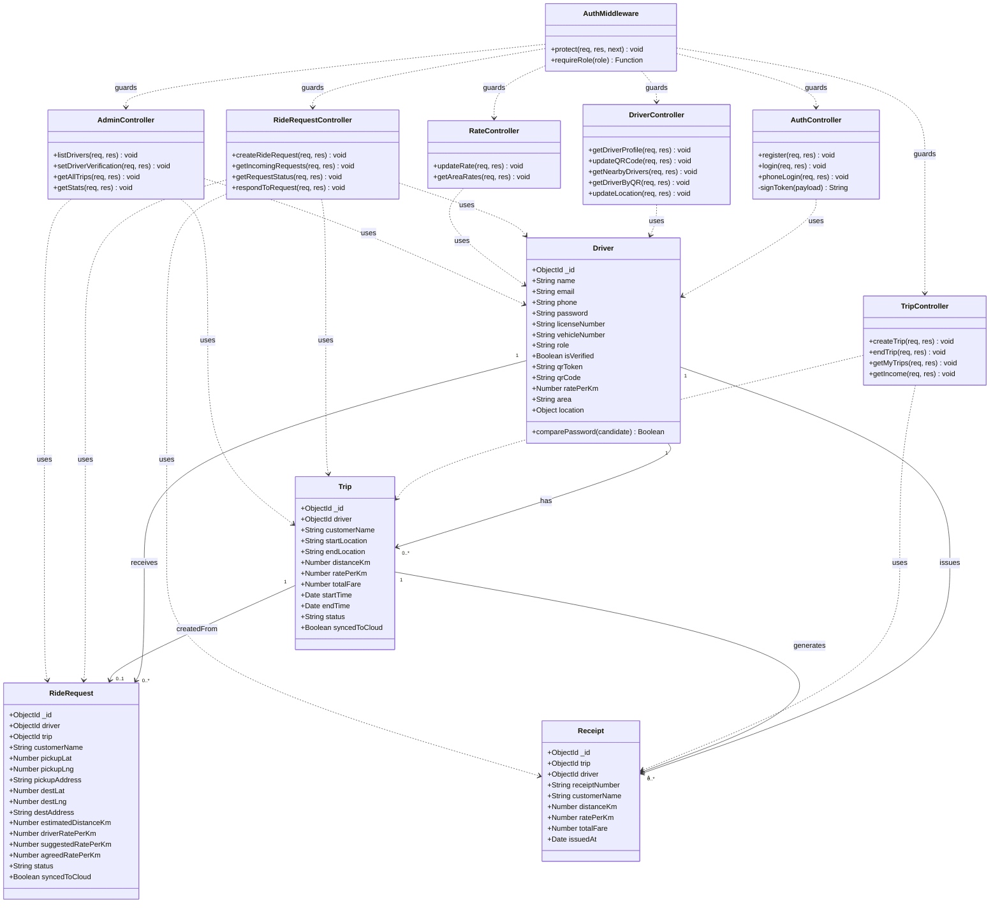

# Class Diagram

```mermaid
classDiagram
    %% ── Models ──────────────────────────────────────────────────────────────

    class Driver {
        +ObjectId _id
        +String name
        +String email
        +String phone
        +String password
        +String licenseNumber
        +String vehicleNumber
        +String role
        +Boolean isVerified
        +String qrToken
        +String qrCode
        +Number ratePerKm
        +String area
        +Object location
        +comparePassword(candidate) Boolean
    }

    class Trip {
        +ObjectId _id
        +ObjectId driver
        +String customerName
        +String startLocation
        +String endLocation
        +Number distanceKm
        +Number ratePerKm
        +Number totalFare
        +Date startTime
        +Date endTime
        +String status
        +Boolean syncedToCloud
    }

    class RideRequest {
        +ObjectId _id
        +ObjectId driver
        +ObjectId trip
        +String customerName
        +Number pickupLat
        +Number pickupLng
        +String pickupAddress
        +Number destLat
        +Number destLng
        +String destAddress
        +Number estimatedDistanceKm
        +Number driverRatePerKm
        +Number suggestedRatePerKm
        +Number agreedRatePerKm
        +String status
        +Boolean syncedToCloud
    }

    class Receipt {
        +ObjectId _id
        +ObjectId trip
        +ObjectId driver
        +String receiptNumber
        +String customerName
        +Number distanceKm
        +Number ratePerKm
        +Number totalFare
        +Date issuedAt
    }

    %% ── Controllers ─────────────────────────────────────────────────────────

    class AuthController {
        +register(req, res) void
        +login(req, res) void
        +phoneLogin(req, res) void
        -signToken(payload) String
    }

    class DriverController {
        +getDriverProfile(req, res) void
        +updateQRCode(req, res) void
        +getNearbyDrivers(req, res) void
        +getDriverByQR(req, res) void
        +updateLocation(req, res) void
    }

    class TripController {
        +createTrip(req, res) void
        +endTrip(req, res) void
        +getMyTrips(req, res) void
        +getIncome(req, res) void
    }

    class RideRequestController {
        +createRideRequest(req, res) void
        +getIncomingRequests(req, res) void
        +getRequestStatus(req, res) void
        +respondToRequest(req, res) void
    }

    class RateController {
        +updateRate(req, res) void
        +getAreaRates(req, res) void
    }

    class AdminController {
        +listDrivers(req, res) void
        +setDriverVerification(req, res) void
        +getAllTrips(req, res) void
        +getStats(req, res) void
    }

    %% ── Middleware ───────────────────────────────────────────────────────────

    class AuthMiddleware {
        +protect(req, res, next) void
        +requireRole(role) Function
    }

    %% ── Relationships ────────────────────────────────────────────────────────

    Driver "1" --> "0..*" Trip          : has
    Driver "1" --> "0..*" RideRequest   : receives
    Driver "1" --> "0..*" Receipt       : issues
    Trip   "1" --> "0..1" RideRequest   : createdFrom
    Trip   "1" --> "1"    Receipt       : generates

    AuthController      ..> Driver          : uses
    DriverController    ..> Driver          : uses
    TripController      ..> Trip            : uses
    TripController      ..> Receipt         : uses
    RideRequestController ..> RideRequest   : uses
    RideRequestController ..> Driver        : uses
    RideRequestController ..> Trip          : uses
    RideRequestController ..> Receipt       : uses
    RateController      ..> Driver          : uses
    AdminController     ..> Driver          : uses
    AdminController     ..> Trip            : uses
    AdminController     ..> RideRequest     : uses

    AuthMiddleware      ..> AuthController       : guards
    AuthMiddleware      ..> DriverController      : guards
    AuthMiddleware      ..> TripController        : guards
    AuthMiddleware      ..> RideRequestController : guards
    AuthMiddleware      ..> RateController        : guards
    AuthMiddleware      ..> AdminController       : guards
```
