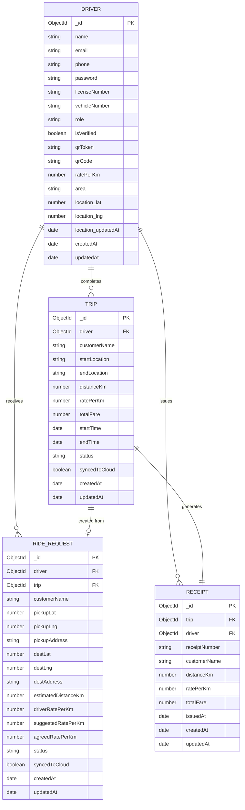

# Entity-Relationship Diagram

```mermaid
erDiagram
    DRIVER {
        ObjectId _id PK
        string   name
        string   email
        string   phone
        string   password
        string   licenseNumber
        string   vehicleNumber
        string   role
        boolean  isVerified
        string   qrToken
        string   qrCode
        number   ratePerKm
        string   area
        number   location_lat
        number   location_lng
        date     location_updatedAt
        date     createdAt
        date     updatedAt
    }

    TRIP {
        ObjectId _id PK
        ObjectId driver FK
        string   customerName
        string   startLocation
        string   endLocation
        number   distanceKm
        number   ratePerKm
        number   totalFare
        date     startTime
        date     endTime
        string   status
        boolean  syncedToCloud
        date     createdAt
        date     updatedAt
    }

    RIDE_REQUEST {
        ObjectId _id PK
        ObjectId driver FK
        ObjectId trip FK
        string   customerName
        number   pickupLat
        number   pickupLng
        string   pickupAddress
        number   destLat
        number   destLng
        string   destAddress
        number   estimatedDistanceKm
        number   driverRatePerKm
        number   suggestedRatePerKm
        number   agreedRatePerKm
        string   status
        boolean  syncedToCloud
        date     createdAt
        date     updatedAt
    }

    RECEIPT {
        ObjectId _id PK
        ObjectId trip FK
        ObjectId driver FK
        string   receiptNumber
        string   customerName
        number   distanceKm
        number   ratePerKm
        number   totalFare
        date     issuedAt
        date     createdAt
        date     updatedAt
    }

    DRIVER ||--o{ TRIP          : "completes"
    DRIVER ||--o{ RIDE_REQUEST  : "receives"
    DRIVER ||--o{ RECEIPT       : "issues"
    TRIP   ||--o| RIDE_REQUEST  : "created from"
    TRIP   ||--|| RECEIPT       : "generates"
```
