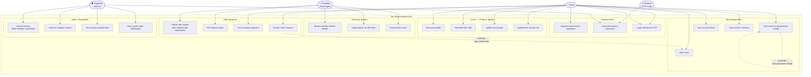

# Use Case Diagram

```mermaid
graph TB
    %% ── Actors ──────────────────────────────────────────────────────────────
    Customer(["👤 Customer\n(Passenger)"])
    Driver(["🚖 Driver"])
    Regulator(["🛡️ Regulator\n(Admin)"])
    Firebase(["🔥 Firebase\n(OTP Auth)"])

    %% ── System boundary ─────────────────────────────────────────────────────
    subgraph System ["Taxi Meter Backend API"]

        subgraph Auth ["Authentication"]
            UC1["Register with email & password"]
            UC2["Login with email & password"]
            UC3["Login with phone OTP"]
        end

        subgraph DriverProfile ["Driver — Profile & Identity"]
            UC4["View own profile"]
            UC5["Generate QR code"]
            UC6["Update live location"]
            UC7["Update fare rate per km"]
        end

        subgraph Discovery ["Discovery (public)"]
            UC8["Browse nearby verified drivers"]
            UC9["Lookup driver by QR token"]
            UC10["Get area fare rates"]
        end

        subgraph Rides ["Ride Requests"]
            UC11["Submit ride request\n(with optional fare negotiation)"]
            UC12["Poll request status"]
            UC13["View incoming requests"]
            UC14["Accept / reject request"]
        end

        subgraph Trips ["Trip Management"]
            UC15["Start a trip"]
            UC16["End a trip & auto-generate receipt"]
            UC17["View my trip history"]
            UC18["View income summary"]
        end

        subgraph Admin ["Admin / Regulation"]
            UC19["View all drivers\n(filter verified / unverified)"]
            UC20["Verify or suspend a driver"]
            UC21["View all trips system-wide"]
            UC22["View system stats dashboard"]
        end
    end

    %% ── Actor → Use Case ────────────────────────────────────────────────────
    Customer --> UC11
    Customer --> UC12
    Customer --> UC8
    Customer --> UC9
    Customer --> UC10

    Driver --> UC1
    Driver --> UC2
    Driver --> UC3
    Driver --> UC4
    Driver --> UC5
    Driver --> UC6
    Driver --> UC7
    Driver --> UC13
    Driver --> UC14
    Driver --> UC15
    Driver --> UC16
    Driver --> UC17
    Driver --> UC18

    Regulator --> UC2
    Regulator --> UC19
    Regulator --> UC20
    Regulator --> UC21
    Regulator --> UC22

    Firebase --> UC3

    %% ── Include / Extend ────────────────────────────────────────────────────
    UC14 -. "«extend»\nauto-creates trip" .-> UC15
    UC16 -. "«include»\nauto-generates receipt" .-> UC16
```
